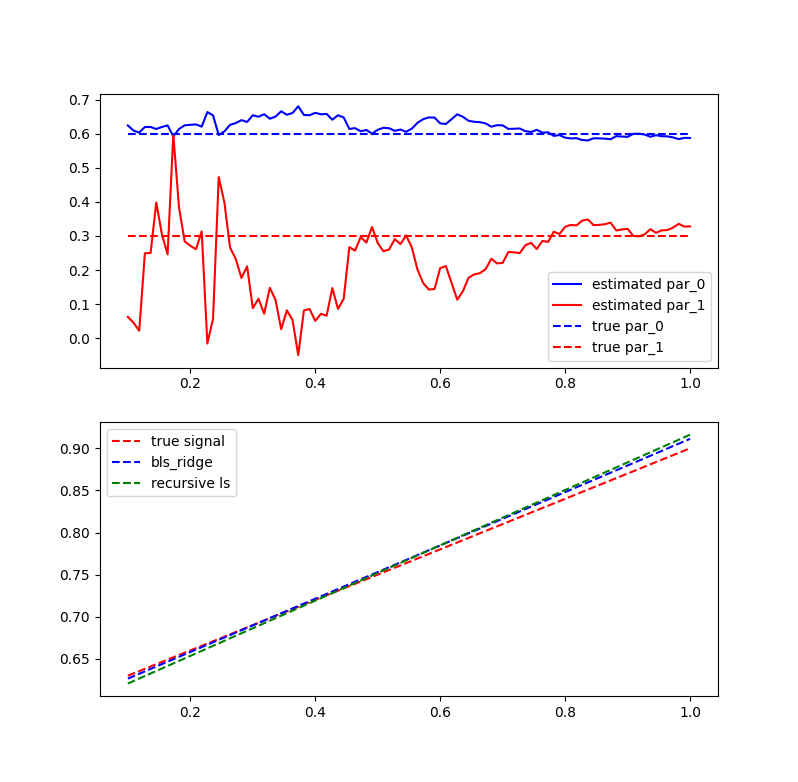

# Recursive least squares example in Python

## Goal
We want to estimate parameters based on a number
of observations.  
With Recursive Least Squares (RLS) we want to do it
in an online fashion,  
updating the prediction whenever we get a new observation.  
The old observations can be discarded.

The basic concept is as follows:

## Algorithm

**Initial values:**  
The initial value for beta is often set 
to 0, with delta we can adjust our trust in that value.  
A high delta (typically around 100) implies low trust. 

## Examples
The first example compares batch least squares regression (bls) 
with RLS using 200 samples.  

In the second example we estimate a sin curve with RLS using 300 samples.  

